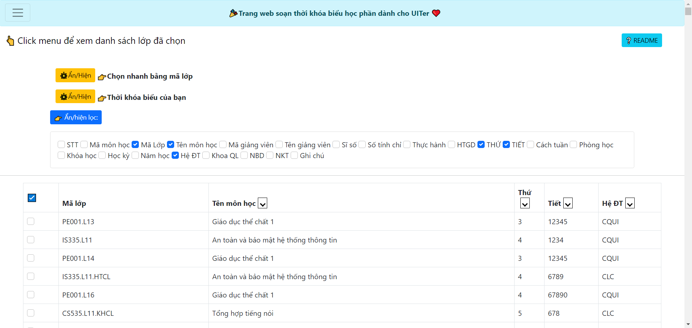
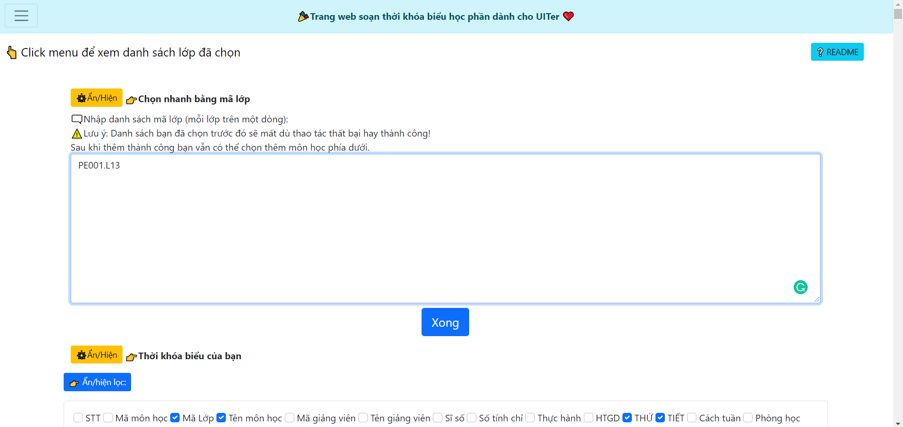
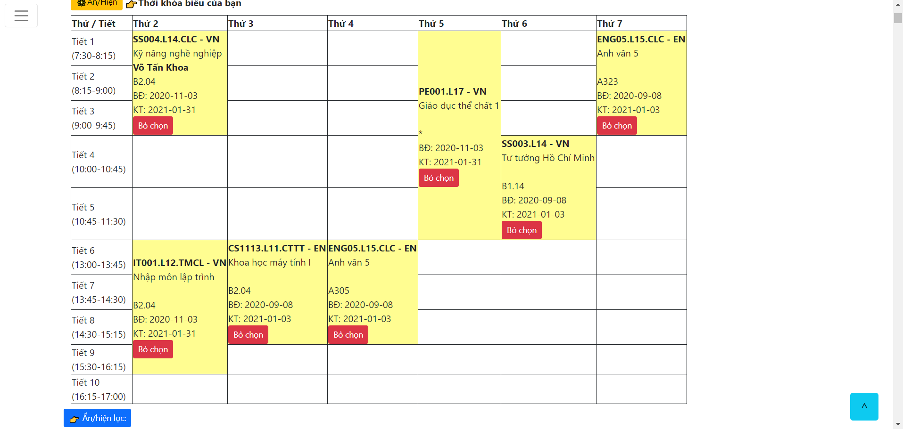
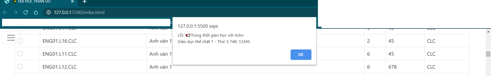

# soan-tkbhp-UIT

🎉 Website hỗ trợ soạn thời khóa biểu học phần cho UITer.

## Một vài hình ảnh:

- ✨Giao diện chính

- 🎢Tạo nhanh thời khóa biểu bằng danh sách mã môn học

- 🛒Table thời khóa biểu tiện lợi cho việc lựa chọn

- 🏷Báo lỗi khi chọn môn học trùng thời gian

## Phiên bản hiện tại:

- HK2-[2021-2022]

## Tính năng đang phát triển

- 🗜Lọc và tìm kiếm nhanh hơn
- 🤿Cache sẽ có trong tương lai hiện tại reload lại sẽ mất toàn bộ dữ liệu người dùng.
- 📊Thống kê vào cơ sở dữ liệu số lượng môn học được chọn.
- 🦸‍♂️[ChatBot](https://github.com/hidang/bot-tkb-hocphan-UIT) soạn tkb liên kết với trang web đang được phát triển.
- 🙇‍♂️Xem thêm các dự án khác tại github.com/hidang

### Đóng góp ý kiến và báo lỗi giúp mình [tại đây](https://github.com/hidang/soan-tkbhp-UIT/issues) nhé ❤
